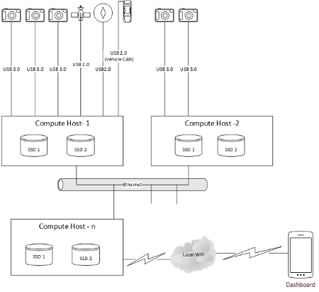
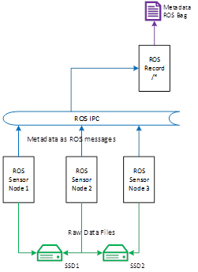
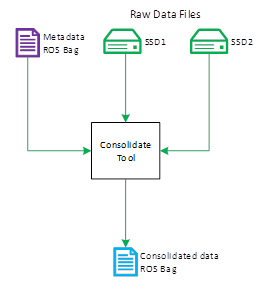

# Design Considerations

Driving on a road used by regular road vehicles and collecting visual, inertial, location, vehicle and other sensory inputs pose challenges in building an operator friendly and reliable system. Below listed are some design considerations in building such a system.

## Usability
A significant amount of time is spent in calibrating the sensors. Hence simple to use calibrations tools should be available to manage the sensor suite on a vehicle. The sensor suite configuration should be persisted to be used in capture sessions. Also, any change to the sensor array configuration should result in minimal changes to the system.

The final data should be available in a well-known format with tools for viewing and editing. E.g ROS Bags.

Also, a remote dashboard displaying status information of the sensors and the system performance in terms of computing and storage would help the operator to plan her capture sessions effectively. Preferably the dashboard UI should be platform agnostic. There should be minimal steps to connect to the system e.g Connect to wifi or ethernet network and access the dashboard via a browser.

## Scalability

Scaling of computing, storage, and sensor infrastructure warrants a loosely coupled architecture of distributed nodes with a capability to embrace varied configurations with minimal operator intervention. Using a framework like ROS helps in managing distributed capture and recording.

## Storage

In a data collection scenario, a high volume of raw sensor data gets generated. The number one objective of a capture session is to record everything that the sensor observes without any loss of information. This is an IO bound application. 

To maximize performance, the application can be split into two stages. In stage 1, the raw sensor data is persisted as quickly as possible to the fastest available storage device with minimal or no copies and no encoding. Writing of raw data is also multiplexed across available storage to make the best use of IO bandwidth. Required metadata is generated and recorded as a single coherent stream from different sensors. This helps in reducing delays or frame drops to keep up with the sensor's data production rate.

In stage 2, the metadata and the raw instances of sensor data are processed and a coherent data stream is generated with necessary encoding. Stage 2 doesn't need to be real-time, it can be run offline and independent of stage 1. Daisy chaining of stage 2 with stage 1 is not required from a performance perspective.

During a capture session, storage devices connected to a host might run out of free space. The framework should be able to handle cold swapping of storage. Since stage 2 can be executed in a different computing environment, storage device should be uniquely identified using tools like blkid.

## Synchronisation

There is a significant delay from the time when the sensor starts capturing the data and the time when it reaches the software stack. Hence an external system should be used as a trigger to start the capture cycle of various sensors. Sensors' capture cycle would be vary based on their type and the environment. Metadata should record the trigger time, capture time as reported by the sensors and also the timestamp when it was persisted. This information would be useful in stage 2.
